# Docker + Nginx Web Application on AWS EC2

## 📌 Project Overview

This project demonstrates how to **run a web application using Docker and Nginx on an Amazon EC2 instance**.

The project starts with the official Nginx Docker image and then creates a **custom Docker image** using a Dockerfile. The custom image contains an HTML webpage and is deployed as a Docker container on an AWS EC2 instance.

Two Nginx containers are used to demonstrate Docker containers and port mapping:

* **Port 80** → Standard Nginx container
* **Port 8080** → Custom Nginx container serving my webpage

---

## 🎯 Project Objective

The main objective of this project is to understand the basic Docker workflow:

```text
Dockerfile → Docker Image → Docker Container → Port Mapping → Web Application
```

This project demonstrates how an application can be packaged into a Docker image and run inside a container.

---

## 🏗️ Architecture

```text
                         Internet
                            |
                            ↓
                  AWS Security Group
                     /            \
                    /              \
               Port 80           Port 8080
                  |                  |
                  ↓                  ↓
          Standard Nginx      Custom Nginx
             Container           Container
                  |                  |
                  ↓                  ↓
        Welcome to Nginx!       index.html
                                     |
                                     ↓
                              Custom Website
```

---

## 🛠️ Technologies Used

* Amazon EC2
* Docker
* Nginx
* Linux
* HTML
* AWS Security Groups
* Git
* GitHub

---

## 📂 Project Structure

```text
docker-nginx-project/
│
├── Dockerfile
├── index.html
├── README.md
│
└── screenshots/
    ├── 01-project-folder.png
    ├── 02-docker-verification.png
    ├── 03-nginx-image.png
    ├── 04-security-group.png
    ├── 05-nginx-container.png
    ├── 06-default-nginx-page.png
    ├── 07-dockerfile.png
    ├── 08-index-html.png
    ├── 09-custom-docker-image.png
    ├── 10-both-containers.png
    ├── 11-custom-website.png
    
```

---

# 🐳 Docker Setup

## 1. Verify Docker Installation

Docker was verified using:

```bash
docker --version
```

Detailed Docker information was checked using:

```bash
docker info
```

Docker disk usage was checked using:

```bash
docker system df
```

---

## 2. Download the Nginx Docker Image

The official Nginx image was downloaded using:

```bash
docker pull nginx
```

The downloaded images were viewed using:

```bash
docker images
```

The `nginx` image is used as the base image for the project.

---

# 🌐 Standard Nginx Container

A standard Nginx container was created using:

```bash
docker run -d -p 80:80 nginx
```

### Port Mapping

```text
EC2 Host Port 80 → Container Port 80
```

The container runs Nginx using its default configuration and displays the standard:

**Welcome to nginx!**

page.

The running container was checked using:

```bash
docker ps
```

---

# 📄 Creating the Dockerfile

The Dockerfile defines how the custom Docker image should be created.

### Dockerfile

```dockerfile
FROM nginx
COPY index.html /usr/share/nginx/html/
```

### Explanation

#### `FROM nginx`

Uses the official Nginx Docker image as the base image.

#### `COPY index.html /usr/share/nginx/html/`

Copies the custom `index.html` file into Nginx's default web root directory inside the container.

This allows Nginx to serve the custom webpage instead of the default Nginx webpage.

---

# 🖥️ Custom HTML Website

The `index.html` file contains the custom webpage created for this project.

The webpage displays information about:

* Docker
* Nginx
* Amazon EC2
* Port Mapping
* Container Status

---

# 🔨 Building the Custom Docker Image

The custom Docker image was created using:

```bash
docker build -t nginx2 .
```

### Command Explanation

```text
docker build
```

Creates a Docker image.

```text
-t nginx2
```

Assigns the name `nginx2` to the image.

```text
.
```

Uses the current directory as the Docker build context.

The resulting image was verified using:

```bash
docker images
```

---

# 🚀 Running the Custom Container

The custom Docker image was started using:

```bash
docker run -d -p 8080:80 nginx2
```

### Port Mapping

```text
EC2 Host Port 8080 → Container Port 80
```

Nginx still listens on **port 80 inside the container**.

Docker maps the EC2 host's port **8080** to the container's port **80**.

The running containers were checked using:

```bash
docker ps
```

This shows both containers running simultaneously:

```text
Port 80   → Standard Nginx
Port 8080 → Custom Nginx
```

---

# 🔌 Port Mapping

| EC2 Host Port | Container Port | Purpose              |
| ------------: | -------------: | -------------------- |
|            80 |             80 | Standard Nginx       |
|          8080 |             80 | Custom Nginx Website |

### Port 80

```text
EC2 Port 80 → Container Port 80
```

This displays the default Nginx webpage.

### Port 8080

```text
EC2 Port 8080 → Container Port 80
```

This displays the custom webpage created in `index.html`.

---

# 🔐 AWS Security Group Configuration

The EC2 Security Group was configured to allow the required traffic.

| Type       | Port | Purpose              |
| ---------- | ---: | -------------------- |
| SSH        |   22 | Remote access to EC2 |
| HTTP       |   80 | Standard Nginx       |
| Custom TCP | 8080 | Custom Nginx Website |

Port **22** is used for SSH access.

Port **80** allows access to the standard Nginx container.

Port **8080** allows access to the custom Nginx container.

---

# 🌍 Accessing the Application

### Standard Nginx

Open the following in a browser:

```text
http://EC2-PUBLIC-IP
```

This displays:

```text
Welcome to nginx!
```

### Custom Website

Open:

```text
http://EC2-PUBLIC-IP:8080
```

This displays the custom HTML webpage created for the project.

---

# 📸 Project Screenshots

## 1. Project Folder

Shows the project directory and its files.

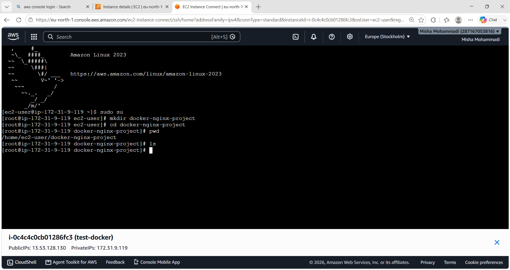

---

## 2. Docker Verification

Shows Docker version, Docker information, and Docker disk usage.

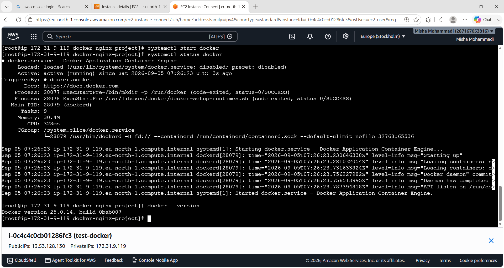

---

## 3. Nginx Docker Image

Shows the official Nginx Docker image downloaded using Docker.

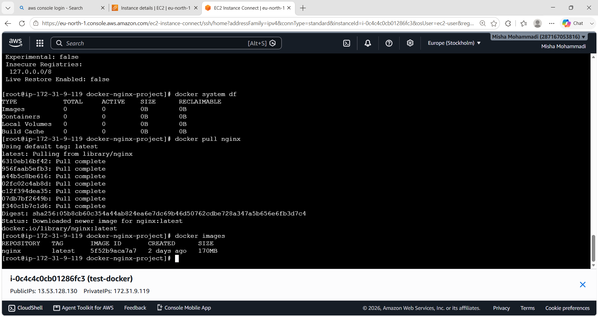

---

## 4. AWS Security Group

Shows the inbound rules configured for SSH, HTTP, and port 8080.

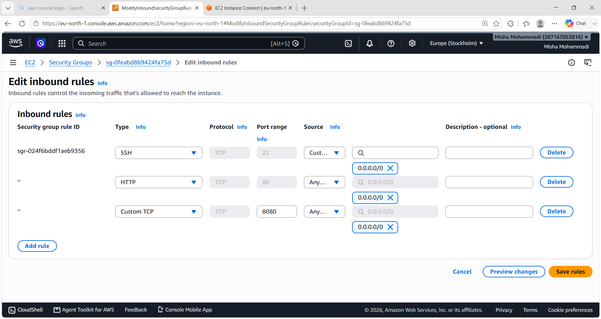

---

## 5. Standard Nginx Container

Shows the standard Nginx container running on port 80.

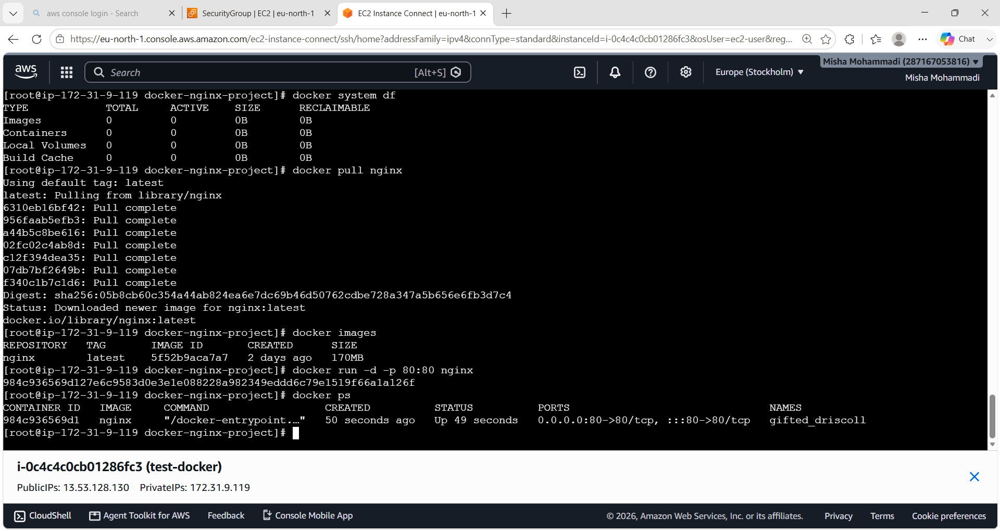

---

## 6. Default Nginx Page

Shows the default Nginx welcome page running from the standard container.

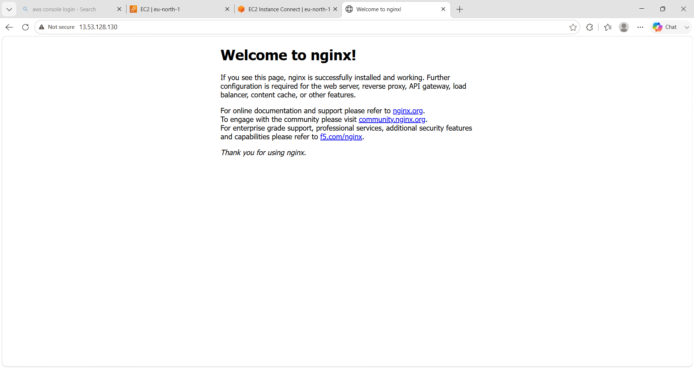

---

## 7. Dockerfile

Shows the Dockerfile used to create the custom Nginx image.

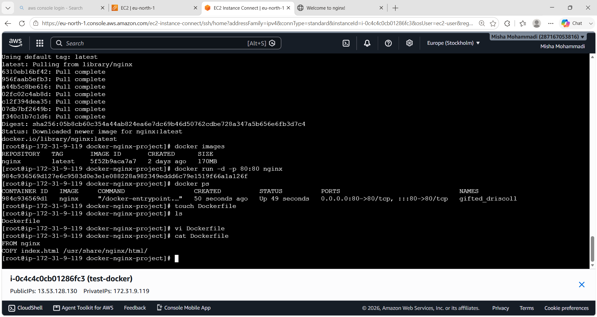

---

## 8. Custom index.html

Shows the custom HTML webpage used by the Nginx container.

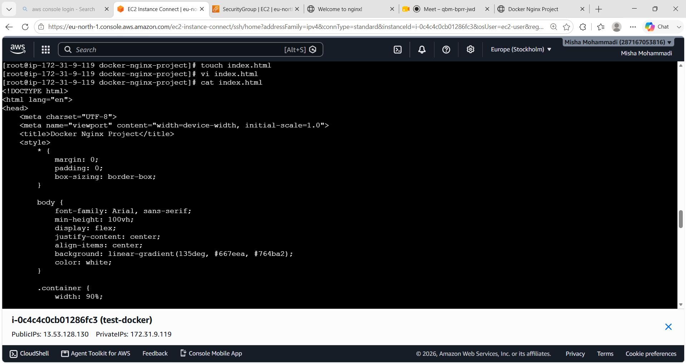

---

## 9. Custom Docker Image

Shows the custom `nginx2` Docker image created using the Dockerfile.

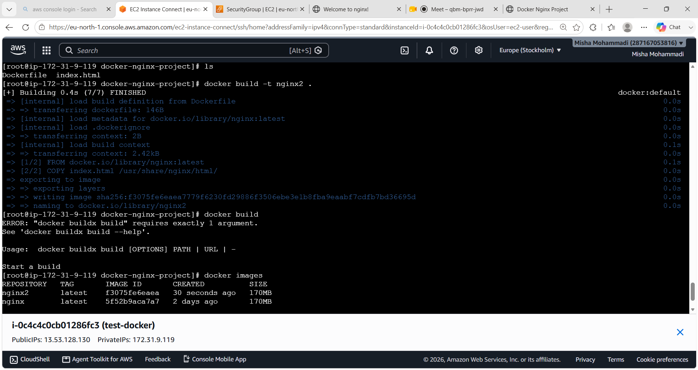

---

## 10. Both Containers Running

Shows both Nginx containers running simultaneously:

* Standard Nginx → Port 80
* Custom Nginx → Port 8080

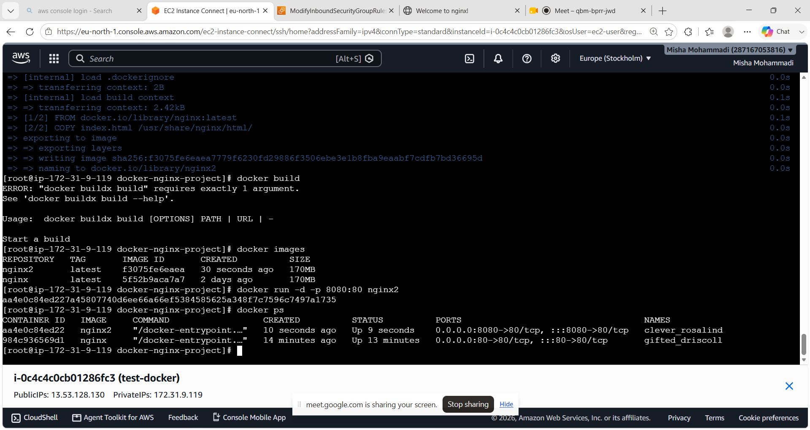

---

## 11. Custom Website

Shows the final custom webpage served by the Docker container.

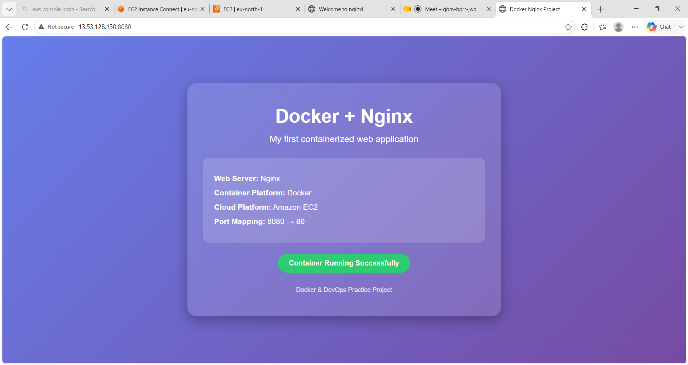

---


# 📊 Docker Commands Used

| Command             | Purpose                           |
| ------------------- | --------------------------------- |
| `docker --version`  | Check Docker version              |
| `docker info`       | Display Docker system information |
| `docker system df`  | Display Docker disk usage         |
| `docker pull nginx` | Download Nginx image              |
| `docker images`     | List Docker images                |
| `docker run`        | Create and start a container      |
| `docker ps`         | List running containers           |
| `docker ps -a`      | List all containers               |
| `docker build`      | Build a Docker image              |

---

# 💡 Key Docker Concepts

## Docker Image

A Docker image is a **blueprint/package** used to create containers.

Examples:

```text
nginx
nginx2
```

## Docker Container

A container is a **running instance of a Docker image**.

For example:

```text
Nginx Image
     ↓
Nginx Container
```

## Dockerfile

A Dockerfile contains instructions for creating a Docker image.

The workflow is:

```text
Dockerfile
     ↓
docker build
     ↓
Docker Image
     ↓
docker run
     ↓
Docker Container
```

---

# 🎯 What This Project Demonstrates

This project demonstrates:

* Docker installation and verification
* Pulling Docker images
* Working with Docker images
* Creating a Dockerfile
* Creating a custom Docker image
* Running Docker containers
* Running multiple containers
* Docker port mapping
* Nginx web server
* AWS EC2 deployment
* AWS Security Group configuration
* Accessing a containerized web application
* Git and GitHub project management

---

# ✅ Final Result

Successfully created and deployed a **custom Nginx Docker image on an Amazon EC2 instance**.

The project demonstrates how a web application can be packaged into a Docker image, deployed as a container, and accessed through different host ports.

### Final Architecture

```text
                    AWS EC2
                       |
                 Docker Engine
                  /          \
                 /            \
          Port 80              Port 8080
             |                    |
             ↓                    ↓
      Nginx Container      Custom Nginx Container
             |                    |
             ↓                    ↓
    Default Nginx Page       Custom index.html
                                     |
                                     ↓
                              Custom Website
```

---

## 🚀 Key Takeaway

```text
Dockerfile
     ↓
docker build
     ↓
Docker Image
     ↓
docker run
     ↓
Docker Container
     ↓
Port Mapping
     ↓
Web Application
```

This project provides a practical foundation for understanding **Docker containerization and basic cloud deployment using AWS EC2**.
